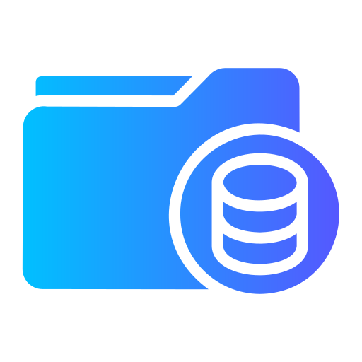

#  SecureDocs

A document management system built with **Laravel**, **Vue.js**, and **Inertia.js**, designed for secure and efficient document storage and management. This application integrates **AWS S3** for robust file storage, includes a **recycle bin** for safe document recovery, and utilizes **Google Drive’s document viewer** to preview files directly within the application.

## Features

- **AWS S3 Storage**: Secure, scalable document storage using Amazon S3.
- **Recycle Bin**: Soft-deletion and recovery of documents, allowing users to retrieve accidentally deleted files.
- **Document Viewer**: In-app file previews using Google Drive’s document viewer, supporting a range of file types.
- **Role-Based Access Control**: Controlled access with customizable permissions based on user roles.
- **Real-Time Notifications**: Notifications for key document actions, like upload, deletion, and recovery.
- **Responsive Design**: Built to ensure a seamless experience on both desktop and mobile devices.

## Tech Stack

-  Laravel
-  Vue.js
-  Inertia.js
-  AWS S3
-  Google Drive Viewer API
-  PostgreSQL

## Usage

1. **Upload Files**: Store documents securely in AWS S3 with metadata for easy organization.
2. **Recycle Bin Management**: Restore or permanently delete files from the recycle bin.
3. **Document Preview**: View documents in the browser using Google Drive's viewer.
4. **Manage Access**: Control document access with role-based permissions for different user levels.
